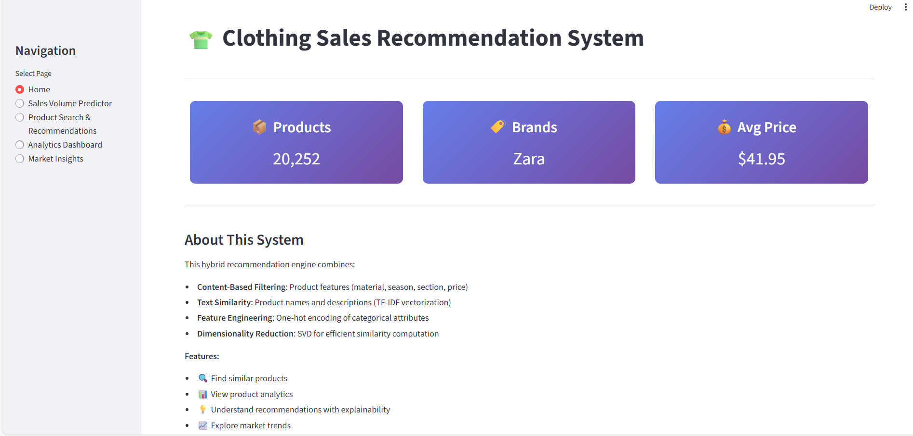
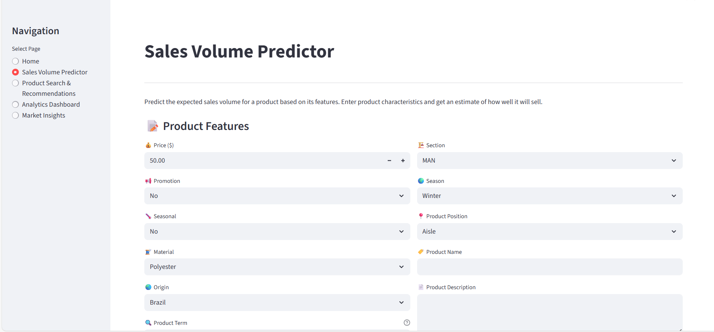
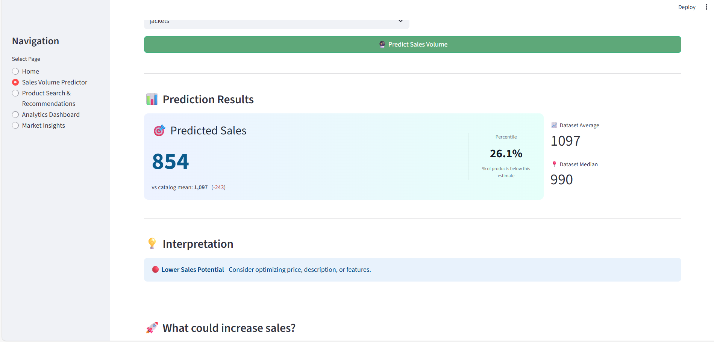
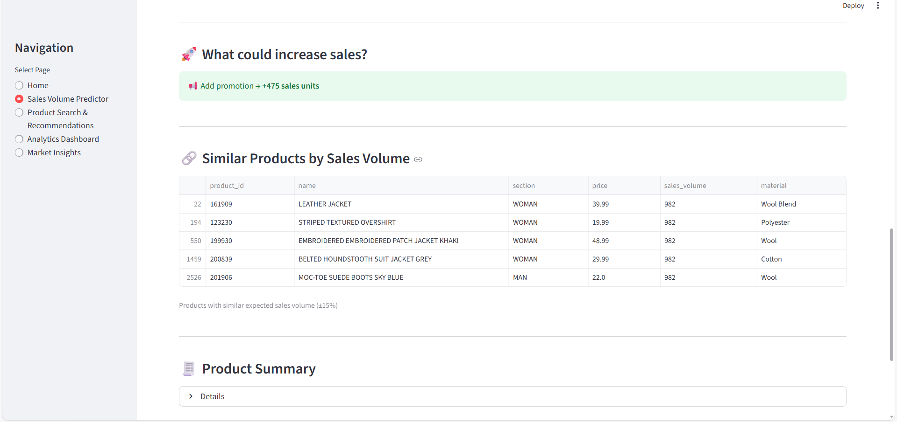
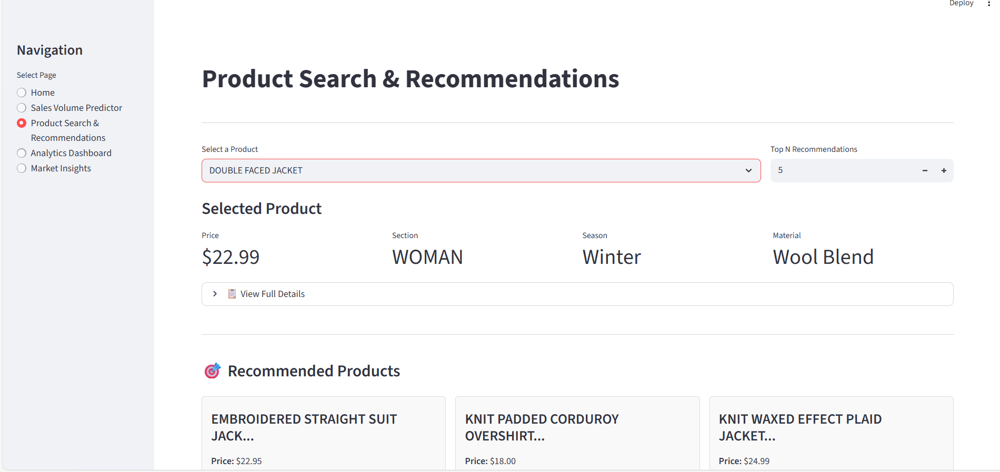
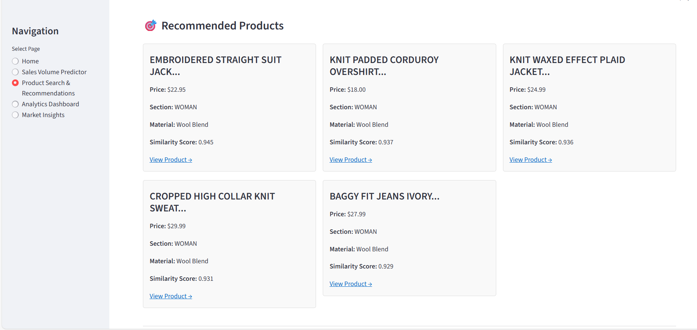

# 👗 Clothing Sales Prediction & Recommendation System

A full-stack machine learning dashboard that predicts clothing sales volume and provides intelligent product recommendations. Built with Python, scikit-learn, and Streamlit for fast, memory-efficient analysis.

**Contents**
- [Quick Start](#quick-start)
- [Features](#features)
- [Architecture](#architecture)
- [Data & Models](#data--models)
- [Application Pages](#application-pages)
- [Performance Optimizations](#performance-optimizations)
- [Troubleshooting](#troubleshooting)
- [Development](#development)

---

## Quick Start (Windows PowerShell)

Install dependencies:
```powershell
pip install -r requirements.txt
```

Run the Streamlit app:
```powershell
streamlit run app/app.py
```

Open the provided local URL in your browser (usually `http://localhost:8501`).

---

## Features

### 📈 Sales Volume Prediction

* Predicts expected sales volume for a new or existing clothing item
* Uses **numerical, categorical, and text‑based features**
* Includes **percentile ranking** to show how a product compares to the catalog
* Provides interpretation such as *High / Average / Low Sales Potential*

### 💡 “What Could Increase Sales?” Insights

* Suggests improvements based on model behavior
* Highlights actionable factors like:

  * Price range
  * Product description richness
  * Category and season alignment

### 🎯 Product Recommendation System

 Content‑based recommendation using:
* Product name & description (TF‑IDF)
* Metadata (section, season, material, brand, price)
* Adjustable Top‑N recommendations
* Displays similarity scores

### 🔍 Explainable Recommendations

Instead of black‑box results, each recommendation explains *why* it was chosen:

* Shared material, section, season, or brand
* Similar keywords in product names

Example explanations:

* 🧵 Same material (Cotton) | 🏷️ Same section (WOMAN)
* 📝 Similar product name keywords | 💰 Similar price range

---

## 🧠 Machine Learning Architecture

### Sales Prediction Model

* Preprocessing with **Scikit‑learn Pipelines**
* Feature types:

  * Numerical: price, rating, review count
  * Categorical: section, season, material
  * Text: product name & description
* Model: Gradient Boosting 

### Recommendation Engine

* TF‑IDF Vectorization on text features
* Cosine similarity matrix
* Hybrid similarity using metadata filters

---

## 🖥️ Application Screenshots

### Home Page


### Sales Volume Predictor





### Product Search & Recommendations



### Analytics Dashboard


### Market Insights


---

## 🛠️ Tech Stack

* **Python**
* **Pandas, NumPy**
* **Scikit‑learn**
* **TF‑IDF & Cosine Similarity**
* **Streamlit**
* **Matplotlib / Seaborn (EDA)**

---

## 📂 Project Structure

```
Clothing-Sales-Prediction-and-Recommendation/
│
├── README.md                           
├── requirements.txt                    
├── .gitignore                          
│
├── data/
│   ├── raw/
│   │   └── clothing_sales.csv         
│   └── processed/
│       └── clean_clothing_sales.csv    
│
├── models/                             # Trained pipelines & matrices
│   ├── hybrid_recommender_pipeline.pkl        # TF-IDF + metadata vectorizer
│   ├── svd_transformer.pkl                    # SVD dimensionality reduction
│   ├── hybrid_similarity_matrix.npz           # Raw similarity matrix
│   ├── hybrid_similarity_matrix_float32.npy   # Memory-mapped float32 
│   ├── hybrid_similarity_matrix_float32.npz   # Compressed float32 backup
│   ├── sales_gb_tuned_pipeline.pkl            # Gradient Boosting predictor
│   └── sales_rf_baseline_pipeline.pkl         # Baseline predictor
│
├── notebooks/
│   ├── 01_eda_data_cleaning.ipynb             
│   ├── 02_feature_engineering.ipynb           
│   ├── 03_multi_model_comparison.ipynb       
│   └── 04_hybrid_recommendation.ipynb         
│
├── app/                                # Streamlit application
│   ├── app.py                          
│   ├── utils.py                        
│   ├── recommendation_helpers.py       
│   └── README.md                       
│
├── screenshots/                        # App UI screenshots
│   ...
│
└── .streamlit/
    └── config.toml                     # Streamlit configuration
```

---

## ▶️ How to Run Locally

```bash
# Clone repository
git clone https://github.com/Lenora04/Clothing-Sales-Prediction-and-Recommendation.git

# Install dependencies
pip install -r requirements.txt

# Run the app
streamlit run app/app.py
```

---

data source - https://www.kaggle.com/datasets/ayeshasiddiqa123/bussiness-sales-dataset
